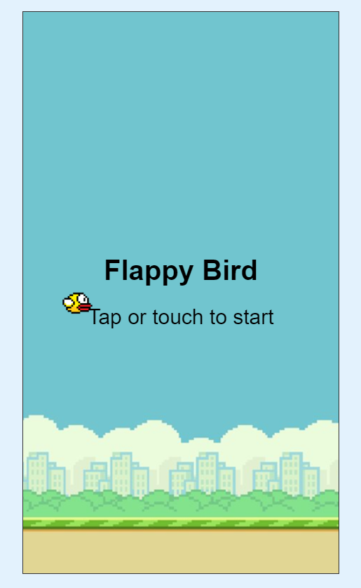
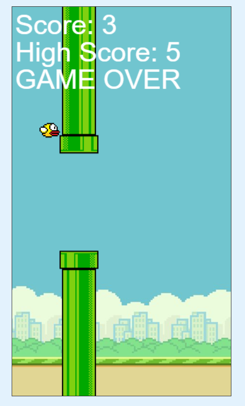

# Flappy Bird Game With HTML, CSS AND JAVASCRIPT

  

## Overview
  
Hey there! I'm Ashraful Alam from Bangladesh, a passionate software developer. This is a simple Flappy Bird game implemented using HTML, CSS, and JavaScript. Flappy Bird is a side-scrolling game where the player controls a bird, attempting to fly between columns of green pipes without hitting them. If it hits the pipe or ground then its game over.

## Credits
<bt> 
    
- **Ashraful Alam** - Software Developer
- International Islamic University Chittagong (IIUC)

## Features
- Classic Flappy Bird gameplay.
- Responsive design for desktop and mobile devices.
- Simple and intuitive user interface.
- Control the bird with mousepad or spacebar or arrow key at laptop and by tapping the display at mobile phone.
- Scoring system to track progress.
- High score system to know the highest score.
- There are three different sound effets.
- When the bird fly upward there would be a wing flapping sound.
- When the bird passes through a pipe there would be a different sound.
- When the bird collides with pipe or ground there would be a different sound.
- Game over detection when the bird collides with pipes or the ground.
- Instantly new game by tapping.
- Colorful visual elements.

## How to Play
1. Open the `index.html` file in your web browser.
2. Control the bird with mousepad or spacebar or arrow key at laptop and by tapping the display at mobile phone to make the bird and fly upward.
3. Navigate the bird through the gaps between the green pipes.
4. Avoid collisions with the pipes or the ground.
5. Keep track of your score as you pass through each set of pipes.
6. Continue playing until the bird collides.
7. When the bird collides the pipe or ground , then the game is over.

## Technologies Used
- HTML5
- CSS3
- JavaScript

# Screenshots

## Before Starting

## GIF Demo Of Playing The Game
  
<!DOCTYPE html>
<html lang="en">
<head>
    <meta charset="UTF-8">
    <meta name="viewport" content="width=device-width, initial-scale=1.0"> 
</head>
<body>
    

        
    

</body>
</html>

  

## Video Demo
  

**In this game I added some sound effects also. But as gif file have no sound its not possible to upload it here. However I uploaded that video at youtube.**

    

**Github doesn't directly support embedding videos into README files. As a result, I've uploaded a video showcasing my project to YouTube for your convenience.
You can watch the video demonstration of the game** [here](https://youtu.be/tZYlnjBgivU?si=RdpvSy9BrvwG3Kyk).

  

## Game Over

